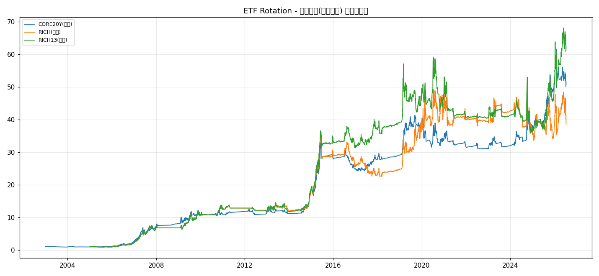

# ETF 轮动 · regime 总闸产品化报告

- 数据: 指数(stock_zh_index_daily) + ETF(fund_etf_hist_sina) + 黄金期货; 纳指ETF 已排除(防过拟合)
- 策略: 月度再平衡, 单边成本0.03%, 信号=20日收益率动量, 持top1; MA200闸门(权益跌破均线剔出) + regime总闸(沪深300 vs MA120, risk-off整仓切防御)
- 推荐配置: 对每个宇宙在 4 组合中选**最大回撤最低者**(回撤优先), 通常即 'MA200开+regime开'
- 交付: 持仓长表CSV(可照做) + 最新一期配置 + 净值图 + 本说明

## 1. 四组合绩效对比(回撤优先)

| 策略 | 累计 | 年化 | 最大回撤 | 夏普 |
|---|---|---|---|---|
| CORE20Y 基准(MA关/regime关) | +2622.8% | +15.66% | -40.65% | 0.80 |
| CORE20Y MA200开 | +3052.1% | +16.41% | -35.19% | 0.88 |
| CORE20Y regime开(MA关) | +4980.9% | +18.88% | -26.10% | 1.10 |
| CORE20Y MA200开+regime开 | +4081.0% | +17.86% | -28.48% | 1.06 |
| RICH 基准(MA关/regime关) | +3546.4% | +18.88% | -68.25% | 0.70 |
| RICH MA200开 | +3171.0% | +18.26% | -51.60% | 0.72 |
| RICH regime开(MA关) | +5778.3% | +21.64% | -38.87% | 0.91 |
| RICH MA200开+regime开 | +3761.9% | +19.21% | -36.68% | 0.84 |
| RICH13 基准(MA关/regime关) | +4805.5% | +20.59% | -68.25% | 0.79 |
| RICH13 MA200开 | +8293.6% | +23.74% | -39.82% | 0.95 |
| RICH13 regime开(MA关) | +6021.8% | +21.88% | -44.45% | 0.99 |
| RICH13 MA200开+regime开 | +6060.5% | +21.92% | -39.54% | 1.00 |

## 2. 最新一期配置(现在该持什么)

- **CORE20Y** (2026-07-10): 中证500 100%
- **RICH** (2026-07-10): 中证500 100%
- **RICH13** (2026-07-10): 中证500 100%

## 3. 如何使用(照做说明)
- 持仓长表 `ETF轮动_产品_持仓.csv` 列: universe, config, date, asset, weight.
- 每月末(T)读取该 universe 当 date 的行: 把 weight>0 的资产按权重配置; 月度再平衡到新一期权重.
- top1 策略通常单资产 100%; 仅在 regime 总闸触发 risk-off 时整仓切防御(国债ETF→货币ETF→上证国债指), 此时该期仅防御资产非零.
- 防御资产本身无趋势信号, 仅作'避险停泊'; regime 回 on 后自动切回动量冠军.
- 纳指ETF 已排除, 不走美股 beta; 黄金/国债作低相关分散与避险.

## 4. 风险提示 & 与主线一致性
- **regime 总闸是本研究已证的最强回撤削减器**(CORE20Y -40.6%→-26.1%; RICH -68.3%→-36.7%), 它切的是'股 vs 债 vs 商品'这种**真正正交的资产状态**, 故有效.
- 这与'因子有寿命, 什么状态用什么因子'同源: 同一哲学在**资产配置层**落地(切资产状态)比在**选股因子层**切因子集更有效——后者已被方向A证为无增量(截面因子缺乏状态正交性).
- 单一牛市 OOS 段(2024-09起)会高估任何牛市依赖策略; 本产品回测跨 20 年多 regime, 更可信. 实盘应跟踪 regime 信号真实性, 谨防极端流动性事件.
*生成于 ETF轮动产品化, 耗时 56.9s*