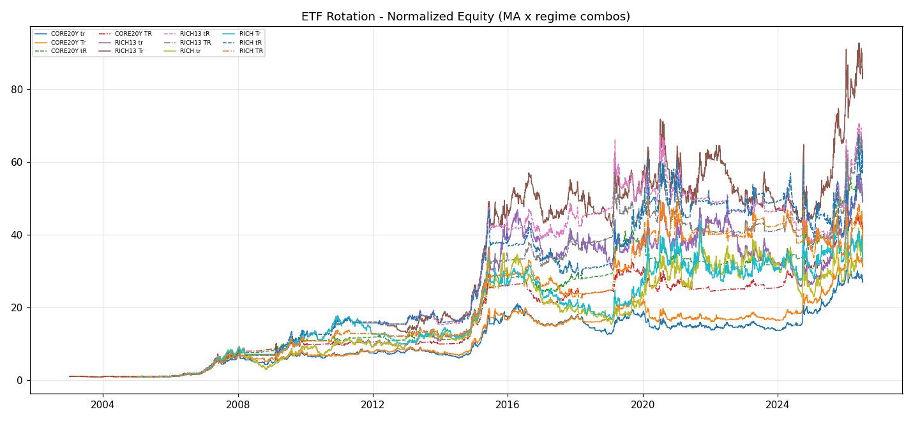

# ETF 轮动 · 扩展报告（丰富宇宙 + 200日闸门 + 20年+）

- 数据: 指数(stock_zh_index_daily) + ETF(fund_etf_hist_sina) + 黄金期货(futures_main_sina); 纳指ETF 已排除(防过拟合)
- 策略: 月度再平衡, 单边成本0.03%, 信号=20日收益率动量, 持top1; MA200闸门=权益跌破200日均线则剔出排名、全弃时切国债ETF
- 宇宙: CORE20Y(长历史指数+国债+黄金期货, 2003起) / RICH13(2013+可用资产) / RICH(全量含恒科可转债, 上市晚)
- 防过拟合: 每宇宙对最优配置做前后半段稳定性切分

## 结果

| 策略 | 累计 | 年化 | 最大回撤 | 夏普 |
|---|---|---|---|---|
| CORE20Y 动量L20top1 基准(MA关/regime关) | +2622.8% | +15.66% | -40.65% | 0.80 |
| CORE20Y 动量L20top1 MA200开 | +3052.1% | +16.41% | -35.19% | 0.88 |
| CORE20Y 动量L20top1 regime开(MA关) | +4980.9% | +18.88% | -26.10% | 1.10 |
| CORE20Y 动量L20top1 MA200开+regime开 | +4081.0% | +17.86% | -28.48% | 1.06 |
| CORE20Y 等权(月度) | +396.8% | +7.31% | -53.08% | 0.55 |
| CORE20Y 沪深300持有 | +344.7% | +6.79% | -72.30% | 0.39 |
| RICH13 动量L20top1 基准(MA关/regime关) | +4805.5% | +20.59% | -68.25% | 0.79 |
| RICH13 动量L20top1 MA200开 | +8293.6% | +23.74% | -39.82% | 0.95 |
| RICH13 动量L20top1 regime开(MA关) | +6021.8% | +21.88% | -44.45% | 0.99 |
| RICH13 动量L20top1 MA200开+regime开 | +6060.5% | +21.92% | -39.54% | 1.00 |
| RICH13 等权(月度) | +155.2% | +4.61% | -35.41% | 0.41 |
| RICH13 沪深300持有 | +386.4% | +7.90% | -72.30% | 0.43 |
| RICH 动量L20top1 基准(MA关/regime关) | +3546.4% | +18.88% | -68.25% | 0.70 |
| RICH 动量L20top1 MA200开 | +3171.0% | +18.26% | -51.60% | 0.72 |
| RICH 动量L20top1 regime开(MA关) | +5778.3% | +21.64% | -38.87% | 0.91 |
| RICH 动量L20top1 MA200开+regime开 | +3761.9% | +19.21% | -36.68% | 0.84 |
| RICH 等权(月度) | +119.1% | +3.84% | -33.74% | 0.39 |
| RICH 沪深300持有 | +386.4% | +7.90% | -72.30% | 0.43 |

## 诚实解读

- **MA200 闸门的价值**: 对比每宇宙 'MA200关' vs 'MA200开' 的回撤与夏普, 看趋势保护是否真正降低回撤(尤其股灾/熊市段).
- **regime 总开关的价值**: 以沪深300 相对其 MA120 判定 risk-on/off, risk-off 时整仓切防御(国债ETF→货币ETF→上证国债指). 对比 'MA200开' vs 'MA200开+regime开' 看市场状态层是否进一步压低回撤、平滑收益; 若 regime 在长历史(CORE20Y 跨20年)显著降低最大回撤而不牺牲太多收益, 说明'什么状态用什么策略'有效.
- **丰富宇宙 vs 7资产**: RICH 比初始7资产多了一堆低相关行业/商品/海外资产, 看夏普/回撤是否因多样性改善, 还是只是数字游戏.
- **过拟合检验**: 若某配置 '前半' 远好于 '后半', 说明是样本内巧合(尤其 RICH 窗口短、资产多). CORE20Y 跨20年多regime, 更可信.
- **纳指已排除**: 避免用单一高收益海外资产把整个轮动'带偏'成美股beta.

*生成于 2026-07-11 17:34*