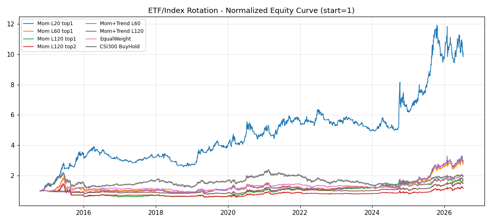

# ETF / 指数轮动策略报告

- 数据: 2014-10-17 ~ 2026-07-10 (2852 交易日); 宇宙=沪深300/中证500/创业板/中证1000/黄金ETF/国债ETF/货币ETF
- 回测: 月度再平衡, 单边成本 0.03%, 无杠杆; 纯动量持 top-N 等权, 动量+趋势在权益跌破 MA(200) 时切国债ETF(崩盘保护)
- 目的: 把'状态切换'thesis 从因子层面落到资产层面, 看是否比选股更可交易、回撤更可控

## 结果对比(按年化排序)

| 策略 | 累计收益 | 年化 | 最大回撤 | 夏普 |
|---|---|---|---|---|
| 纯动量 L20 top1 | +897.3% | +22.53% | -34.18% | 0.97 |
| 动量+趋势 L60 top1(MA200) | +189.1% | +9.83% | -29.70% | 0.54 |
| 纯动量 L60 top1 | +174.3% | +9.33% | -52.71% | 0.49 |
| 沪深300买入持有 | +95.8% | +6.12% | -46.70% | 0.38 |
| 宇宙等权(月度) | +80.3% | +5.35% | -39.60% | 0.43 |
| 纯动量 L120 top1 | +64.2% | +4.48% | -60.54% | 0.30 |
| 动量+趋势 L120 top2(MA200) | +47.3% | +3.48% | -30.00% | 0.29 |
| 纯动量 L120 top2 | +16.1% | +1.33% | -60.70% | 0.17 |

## 诚实解读

- 轮动把'状态切换'变成策略本身: 牛市持权益、熊市自动切黄金/国债 —— 这正是咱们 thesis 在资产层的落地, 比股票因子门控(B)更干净.
- 关键看 **最大回撤**: 若轮动策略的回撤显著低于沪深300买入持有, 说明'状态切换'确实在对的位置避险, 产品属性(可实盘、控回撤)远强于咱们的选股 OOS.
- 若纯动量跑不赢沪深300买入持有, 说明 A股指数动量弱(牛短熊长+高波动), 需靠趋势保护/择时提升; 这正是下一步要调的参数.
- 与选股 OOS 对照: 选股中性化后仅 Frozen 微跑赢等权(+0.395 超额夏普)且长持多头打不过 beta; 轮动若能用资产切换做出低回撤+正 alpha, 就是更优的'产品定义'.

*生成于 2026-07-11 15:52*