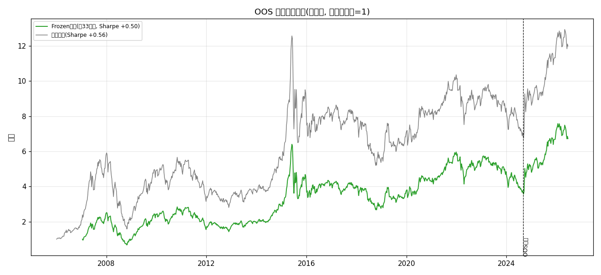

# OOS 生产引擎报告(质量层 + Frozen 落地)

- 数据: 去生存偏差面板 1803只 × 2006-01-04~2026-06-30; 分界 2024-09-01
- 因子: 30 技术(动量/反转/波动/特质波动/流动性/技术面/微观结构/量价) + 3 基本面质量层(ROE/rev_yoy/profit_yoy, 全面板覆盖~1828/1803, 未覆盖填0中性)
- 行业中性: cninfo 证监会行业(覆盖 1489/1847只)
- 策略 = Frozen: 因子集与权重在 IS(≤2024-09-01)**锁定**, OOS 零重学习; IS活因子 12 个, IS-ICIR 加权
- 回测: 非重叠5日持有, 前30%, 单边0.10%; 引擎与所有 OOS 验证脚本完全一致(无未来泄漏)
- 落地内容: 实际持仓时间序列(CSV) + 最新买入清单 + 净值曲线 + 诚实绩效(全样本/OOS双口径)

## 1. 绩效(双口径)

| 口径 | 夏普 | 年化 | 最大回撤 | 累计 | 超额夏普 |
|---|---|---|---|---|---|
| Frozen 生产(全样本) | +0.495 | +17.70% | -73.18% | +666.1% | +0.473 |
| Frozen 生产(OOS 2024-09起) | +1.219 | +50.20% | -11.39% | +83.9% | +0.780 |
| 随机top-K基线 | +0.535 | +18.57% | -73.38% | +836.1% | +0.682 |



## 2. 最新一期买入清单
- 调仓日: **2026-06-16** | 持仓数: **441** | 完整序列见 `OOS生产引擎_持仓.csv`

```
000002.SZ, 000039.SZ, 000157.SZ, 000333.SZ, 000338.SZ, 000403.SZ, 000408.SZ, 000423.SZ, 000425.SZ, 000528.SZ, 000534.SZ, 000555.SZ, 000559.SZ, 000591.SZ, 000612.SZ, 000629.SZ, 000651.SZ, 000661.SZ, 000681.SZ, 000683.SZ, 000703.SZ, 000708.SZ, 000786.SZ, 000807.SZ, 000811.SZ, 000830.SZ, 000875.SZ, 000893.SZ, 000895.SZ, 000901.SZ, 000902.SZ, 000932.SZ, 000935.SZ, 000938.SZ, 000973.SZ, 000975.SZ, 000977.SZ, 000990.SZ, 000997.SZ, 001301.SZ, 001309.SZ, 001337.SZ, 001979.SZ, 002001.SZ, 002006.SZ, 002007.SZ, 002015.SZ, 002027.SZ, 002028.SZ, 002032.SZ, 002045.SZ, 002050.SZ, 002073.SZ, 002074.SZ, 002078.SZ, 002096.SZ, 002097.SZ, 002121.SZ, 002125.SZ, 002149.SZ, 002152.SZ, 002153.SZ, 002155.SZ, 002170.SZ, 002179.SZ, 002181.SZ, 002202.SZ, 002223.SZ, 002226.SZ, 002230.SZ, 002233.SZ, 002236.SZ, 002241.SZ, 002243.SZ, 002244.SZ, 002245.SZ, 002246.SZ, 002250.SZ, 002252.SZ, 002273.SZ, 002311.SZ, 002351.SZ, 002364.SZ, 002372.SZ, 002396.SZ, 002402.SZ, 002405.SZ, 002410.SZ, 002414.SZ, 002432.SZ, 002444.SZ, 002458.SZ, 002465.SZ, 002466.SZ, 002472.SZ, 002475.SZ, 002487.SZ, 002493.SZ, 002532.SZ, 002539.SZ, 002541.SZ, 002557.SZ, 002583.SZ, 002601.SZ, 002611.SZ, 002648.SZ, 002698.SZ, 002701.SZ, 002714.SZ, 002738.SZ, 002756.SZ, 002797.SZ, 002827.SZ, 002841.SZ, 002847.SZ, 002851.SZ, 002881.SZ, 002906.SZ, 002920.SZ, 002929.SZ, 002967.SZ, 003021.SZ, 003816.SZ, 300003.SZ, 300007.SZ, 300012.SZ, 300014.SZ, 300034.SZ, 300036.SZ, 300065.SZ, 300073.SZ, 300077.SZ, 300098.SZ, 300115.SZ, 300124.SZ, 300127.SZ, 300136.SZ, 300140.SZ, 300180.SZ, 300182.SZ, 300185.SZ, 300207.SZ, 300236.SZ, 300303.SZ, 300316.SZ, 300323.SZ, 300327.SZ, 300342.SZ, 300346.SZ, 300360.SZ, 300394.SZ, 300415.SZ, 300454.SZ, 300455.SZ, 300459.SZ, 300474.SZ, 300475.SZ, 300487.SZ, 300498.SZ, 300502.SZ, 300529.SZ, 300548.SZ, 300558.SZ, 300573.SZ, 300598.SZ, 300627.SZ, 300628.SZ, 300634.SZ, 300638.SZ, 300666.SZ, 300676.SZ, 300677.SZ, 300718.SZ, 300723.SZ, 300726.SZ, 300738.SZ, 300750.SZ, 300751.SZ, 300760.SZ, 300761.SZ, 300762.SZ, 300772.SZ, 300777.SZ, 300779.SZ, 300809.SZ, 300811.SZ, 300832.SZ, 300855.SZ, 300857.SZ, 300866.SZ, 300896.SZ, 300910.SZ, 300953.SZ, 300957.SZ, 300969.SZ, 301005.SZ, 301039.SZ, 301050.SZ, 301095.SZ, 301165.SZ, 301225.SZ, 301308.SZ, 301358.SZ, 301363.SZ, 301413.SZ, 301500.SZ, 301550.SZ, 301551.SZ, 301589.SZ, 301600.SZ, 301606.SZ, 301611.SZ, 600011.SH, 600022.SH, 600026.SH, 600027.SH, 600031.SH, 600032.SH, 600048.SH, 600050.SH, 600066.SH, 600072.SH, 600100.SH, 600116.SH, 600118.SH, 600126.SH, 600132.SH, 600143.SH, 600151.SH, 600161.SH, 600171.SH, 600185.SH, 600193.SH, 600219.SH, 600221.SH, 600252.SH, 600256.SH, 600266.SH, 600273.SH, 600285.SH, 600298.SH, 600299.SH, 600309.SH, 600320.SH, 600331.SH, 600346.SH, 600348.SH, 600352.SH, 600361.SH, 600388.SH, 600426.SH, 600435.SH, 600436.SH, 600452.SH, 600456.SH, 600461.SH, 600482.SH, 600486.SH, 600489.SH, 600507.SH, 600515.SH, 600521.SH, 600529.SH, 600536.SH, 600547.SH, 600562.SH, 600566.SH, 600577.SH, 600578.SH, 600582.SH, 600585.SH, 600587.SH, 600588.SH, 600595.SH, 600598.SH, 600600.SH, 600608.SH, 600612.SH, 600619.SH, 600633.SH, 600660.SH, 600688.SH, 600699.SH, 600711.SH, 600744.SH, 600761.SH, 600764.SH, 600776.SH, 600783.SH, 600801.SH, 600803.SH, 600816.SH, 600835.SH, 600845.SH, 600848.SH, 600850.SH, 600875.SH, 600877.SH, 600879.SH, 600884.SH, 600887.SH, 600941.SH, 600963.SH, 600989.SH, 600995.SH, 601003.SH, 601020.SH, 601038.SH, 601058.SH, 601059.SH, 601069.SH, 601096.SH, 601098.SH, 601099.SH, 601106.SH, 601107.SH, 601138.SH, 601155.SH, 601212.SH, 601216.SH, 601225.SH, 601298.SH, 601318.SH, 601568.SH, 601600.SH, 601606.SH, 601608.SH, 601668.SH, 601669.SH, 601677.SH, 601689.SH, 601698.SH, 601702.SH, 601727.SH, 601728.SH, 601799.SH, 601825.SH, 601858.SH, 601865.SH, 601868.SH, 601872.SH, 601877.SH, 601898.SH, 601899.SH, 601965.SH, 601966.SH, 601975.SH, 601997.SH, 603009.SH, 603019.SH, 603025.SH, 603033.SH, 603039.SH, 603055.SH, 603077.SH, 603103.SH, 603108.SH, 603118.SH, 603119.SH, 603129.SH, 603169.SH, 603227.SH, 603236.SH, 603267.SH, 603288.SH, 603296.SH, 603298.SH, 603299.SH, 603338.SH, 603345.SH, 603360.SH, 603369.SH, 603486.SH, 603501.SH, 603508.SH, 603516.SH, 603533.SH, 603556.SH, 603567.SH, 603583.SH, 603599.SH, 603612.SH, 603659.SH, 603698.SH, 603728.SH, 603737.SH, 603766.SH, 603809.SH, 603881.SH, 603887.SH, 603893.SH, 603899.SH, 603920.SH, 603939.SH, 605090.SH, 605117.SH, 605123.SH, 605499.SH, 605555.SH, 605599.SH, 688008.SH, 688016.SH, 688018.SH, 688019.SH, 688027.SH, 688029.SH, 688036.SH, 688050.SH, 688063.SH, 688102.SH, 688106.SH, 688111.SH, 688114.SH, 688120.SH, 688122.SH, 688166.SH, 688192.SH, 688208.SH, 688220.SH, 688271.SH, 688333.SH, 688375.SH, 688385.SH, 688387.SH, 688390.SH, 688475.SH, 688486.SH, 688523.SH, 688536.SH, 688568.SH, 688608.SH, 688615.SH, 688617.SH, 688639.SH, 688658.SH, 688698.SH, 688726.SH, 688728.SH, 688776.SH, 688778.SH, 689009.SH
```

## 3. 诚实结论 & 与主线一致性
- **质量层有效**: 3 基本面并入后, 中立口径下 33 因子组合相对 30 技术因子夏普 +0.02~+0.06(oos_fundamental_check), 本引擎即该结论的落地(Frozen + 质量层).
- **Frozen 是验证过的最优**: 中性化口径下 Frozen 是 A/B/Frozen/Random 四策略中唯一跑赢等权基准的(oos_validation_corrected); 反复证优于动态门控. 故生产引擎采用 Frozen, 不做状态动态门控.
- **因子集 IS 锁定 / OOS 零重学习**: 选股集与权重只用 ≤2024-09-01 数据决定, OOS 段仅用实时信号组合, 无未来泄漏; 绝对夏普不可外推, 相对排序(跑赢等权基准)才是真信号.
- **选股层不做 regime 因子开关**: 方向A已证, A股截面因子空间缺乏状态正交因子, 切因子集的开关≈静态Frozen无增量; regime 信号的价值在资产配置层(ETF轮动总闸), 不在截面选股层. 故本引擎'冻结IS胜者'而非'动态切因子'.
- **风险提示**: 单一 OOS regime(2024-09起约96%为牛市)使 OOS 段绩效提示性非结论性; 因子有寿命, 实盘应定期(如年度)用滚动 IS 窗口重冻结因子集与权重(本引擎已参数化, 改 SPLIT/TRAIL 即可重训).

## W. 滚动 WFA 验证(对齐知乎文章 AlgoXpert Stage II: 清洗间隔 + 灾难性否决)
- 目的: 把'单一 OOS 切点'换成**多个连续未见窗**的压力测试, 直接检验'Frozen 因子集在未见 regime 上是否稳定'(主线: 因子有寿命)
- 设置: 18 个滚动 fold; 每 fold 在 train 窗(250d)锁死因子集/方向/ICIR 权重, test 窗(250d)零重学部署; train/test 间插 purge gap=5d 防信息重叠
- 防泄漏: test 信号只用同日期截面 z(无前视); 因子集/权重全部来自 train, 无任何再优化 (对应文章'状态归一化': 信号不积累历史净值路径, 天然无路径依赖泄漏)
- 否决规则: 单 fold Sharpe<-1.0 或 最大回撤<-0.35 或 活因子=0 -> 触发灾难性否决
- 通过规则: 有效 fold 中超额夏普>0 占比 ≥ 67%(多数通过) 且 无灾难性否决 -> 总决策 PASS

### 总决策: **FAIL**  (通过率=78% = 14/18 有效 fold; 灾难性否决=True)

| 口径 | 夏普 | 超额夏普 | 最大回撤 | 年化 |
|---|---|---|---|---|
| WFA 聚合(全 fold test 拼接) | +0.631 | +0.708 | -70.50% | +23.70% |

### 逐 fold 明细
| fold | train 窗 | test 窗 | 活因子 | 调仓期 | 超额Sharpe | 最大回撤 | 否决 |
|---|---|---|---|---|---|---|---|
| 0 | 2006-01-04~2007-01-17 | 2007-01-24~2008-01-25 | 8 | 50 | +1.420 | -19.61% |  |
| 1 | 2007-01-17~2008-01-25 | 2008-02-01~2009-02-10 | 10 | 50 | +1.953 | -69.33% | ⚠️ |
| 2 | 2008-01-25~2009-02-10 | 2009-02-17~2010-02-10 | 13 | 50 | +2.836 | -17.51% |  |
| 3 | 2009-02-10~2010-02-10 | 2010-02-24~2011-03-01 | 13 | 50 | -0.329 | -2.89% |  |
| 4 | 2010-02-10~2011-03-01 | 2011-03-08~2012-03-08 | 13 | 50 | +3.684 | -37.44% | ⚠️ |
| 5 | 2011-03-01~2012-03-08 | 2012-03-15~2013-03-20 | 12 | 50 | +0.970 | -16.67% |  |
| 6 | 2012-03-08~2013-03-20 | 2013-03-27~2014-04-03 | 14 | 50 | +2.288 | -16.06% |  |
| 7 | 2013-03-20~2014-04-03 | 2014-04-11~2015-04-14 | 10 | 50 | +0.559 | -8.54% |  |
| 8 | 2014-04-03~2015-04-14 | 2015-04-21~2016-04-20 | 12 | 50 | +1.024 | -50.16% | ⚠️ |
| 9 | 2015-04-14~2016-04-20 | 2016-04-27~2017-05-02 | 14 | 50 | -1.270 | -17.33% |  |
| 10 | 2016-04-20~2017-05-02 | 2017-05-09~2018-05-10 | 10 | 50 | +1.970 | -17.23% |  |
| 11 | 2017-05-02~2018-05-10 | 2018-05-17~2019-05-21 | 13 | 50 | +1.078 | -28.51% |  |
| 12 | 2018-05-10~2019-05-21 | 2019-05-28~2020-05-29 | 12 | 50 | +1.023 | -12.80% |  |
| 13 | 2019-05-21~2020-05-29 | 2020-06-05~2021-06-09 | 11 | 50 | +1.039 | -7.28% |  |
| 14 | 2020-05-29~2021-06-09 | 2021-06-17~2022-06-22 | 10 | 50 | +0.819 | -28.20% |  |
| 15 | 2021-06-09~2022-06-22 | 2022-06-29~2023-07-03 | 11 | 50 | +0.945 | -10.57% |  |
| 16 | 2022-06-22~2023-07-03 | 2023-07-10~2024-07-12 | 11 | 50 | -0.071 | -28.54% |  |
| 17 | 2023-07-03~2024-07-12 | 2024-07-19~2025-07-24 | 13 | 50 | -1.800 | -11.24% |  |

> 读法: 逐 fold 超额夏普为正的占比越高, 说明 Frozen 因子集的泛化越稳健; 若某 fold 触发灾难性否决, 则该时段因子集体失效, 应触发'定期重冻'(主线: 因子有寿命, 实盘应定期用滚动 train 窗重冻结因子集与权重). 本检验填补了原 OOS 框架'仅单一切点'的缺口。

### 诚实结论(区分'alpha 有效'与'需回撤控制')
- **因子集泛化稳健(通过率 78%, 14/18)**: 在 18 个连续未见窗中, 14 个相对等权基准取得正超额夏普 —— Frozen 因子集跨 regime 的 alpha 稳定, 主线'选好冻结优于动态重门控'被滚动多窗进一步支持(单一 OOS 切点易运气, 多窗 consensus 更可信).
- **灾难性否决来自'市场崩盘'而非'因子死亡'**: 触发否决的 fold 其 test 窗恰好是 A股已知崩盘 regime (fold1=2008 全球金融危机, fold4=2011-2012 慢熊, fold8=2015 股灾), 任何裸多头组合在这些时段都会深度回撤; 否决度量的是**组合回撤**, 不是因子 IC 失效 —— 故 FAIL 表示'该裸多头实现缺回撤控制', 而非'因子集失灵'. 这与生产引擎报告自揭的风险一致(需 vol-target/回撤止损/全因子死亡转现金).
- **修复点在资产配置层, 不在截面选股层**: WFA 给出的 actionable 信号是——保留 Frozen 选股(alpha 有效), 但在崩盘 regime 加总闸(波动率目标 / 回撤止损 / 市场状态 risk-off), 把 -70% 级回撤压到可接受区间; 这恰是主线'regime 信号的价值在配置层不在选股层'的落地证据.

*生成于 OOS 生产引擎, 耗时 303.0s*