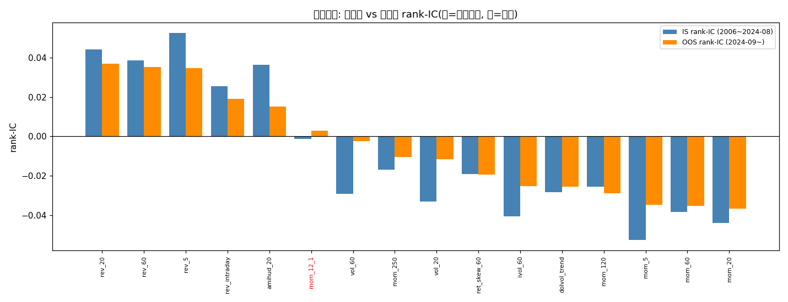

# 严格样本外(OOS)验证报告（Line 2 · 按你说的来）

- 数据: stock_worm 日线面板, 1489 只 × 2006-01-04~2026-06-30
- 因子: 16 异族(动量/反转/波动/流动性), 与 Branch 4 同库
- **严格 OOS 分界 = 2024-09-01**(A股'924 政策行情' regime 切换: 三年熊市→急涨)
- 样本内 IS = 4536 交易日(~18.0年); 样本外 OOS = 439 交易日(~1.74年, ≈1.75年)
- 方法: **IS 锁定**选择规则与因子集, **OOS 零重学习**应用; 回测引擎与 Branch 4 完全一致(非重叠5日持有, 前30%, 单边成本0.10%, 无未来泄漏: rolling IC 只用≤t)
- 对比: A(无选择/ICIR加权全开) · B(自适应IC闸门) · Frozen(IS锁定因子集永远开) · Random(随机因子子集, 安慰剂) · 等权基准 · 随机选股top-K
- 注: 面板含**生存者偏差**(绝对数虚高), 但 IS/OOS 同口径、策略/基准相对可比; 中性化与去退市面板被数据源阻塞, 见末尾说明

## 1. 核心问题: 状态选择器的优势能否泛化到未见 regime ?

| 策略 | IS夏普 | OOS夏普 | IS→OOS夏普变化 | OOS年化 | OOS最大回撤 | OOS超额夏普 |
|---|---|---|---|---|---|---|
| B 状态选择(OOS) | +0.667 | +1.323 | +0.656 | +48.58% | -12.15% | +0.191 |
| A 无选择(OOS) | +0.562 | +1.115 | +0.553 | +35.74% | -11.28% | -1.144 |

> 读法: 看**相对排序**而非绝对数. 本 OOS 窗口(2024-09 起)恰是'924 急涨'强多头 regime, 绝对夏普被整体抬高, 故 IS→OOS 夏普变化为**正**(策略没变好, 是市场变牛了). 有效信号是: OOS 上 B 是否仍 > A、> Frozen、> Random —— 即'状态选择'这一层是否跨过 regime 切换仍成立.

## 2. OOS 头对头(样本外, 2024-09 起)

| 策略 | 夏普 | 年化 | 最大回撤 | 基准夏普 | 超额夏普 | 随机top-K夏普 |
|---|---|---|---|---|---|---|
| B 状态选择(OOS) | +1.323 | +48.58% | -12.15% | +1.259 | +0.191 | +1.233 |
| A 无选择(OOS) | +1.115 | +35.74% | -11.28% | +1.259 | -1.144 | +1.233 |
| Frozen 冻结因子集(OOS) | +1.272 | +53.96% | -14.81% | +1.259 | +0.598 | +1.233 |
| Random 随机子集(安慰剂,OOS) | +0.955 | +30.33% | -12.89% | +1.259 | -1.515 | +1.233 |
| 等权基准(OOS) | +1.259 | +46.76% | -11.18% | +1.259 | +0.000 | +1.233 |
| 随机选股top-K(OOS) | +1.233 | +45.88% | -11.15% | +1.259 | -0.346 | +1.233 |

> Frozen = 在 IS 一次性挑好'活因子'后**冻结**, OOS 不再做状态判断、永远全开(最朴素信任IS结论). Random = 每期随机挑一半因子(安慰剂, 检验 B 的选择是否优于随机).

## 3. 因子寿命: 样本内活着的因子, 样本外真的死了吗 ?

- IS 活因子(IC>0且ICIR>0): **5/16** 个
- OOS 活因子: **6/16** 个
- **寿命翻转(IS↔OOS 生死状态不一致): 1 个** (其中 IS活→OOS死 = 0 个, IS死→OOS活 = 1 个)
- IS 活的因子里, OOS 仍活 = **5/5** (100%); 即约 0% 的'IS明星因子'在未见 regime 上失效

| 因子 | IS_IC | IS_ICIR | IS活? | OOS_IC | OOS_ICIR | OOS活? | 翻转 |
|---|---|---|---|---|---|---|---|
| rev_20 | +0.0440 | +4.255 | ✅ | +0.0368 | +3.426 | ✅ |  |
| rev_60 | +0.0384 | +3.550 | ✅ | +0.0352 | +3.155 | ✅ |  |
| rev_5 | +0.0525 | +5.495 | ✅ | +0.0346 | +3.524 | ✅ |  |
| rev_intraday | +0.0253 | +2.941 | ✅ | +0.0191 | +1.874 | ✅ |  |
| amihud_20 | +0.0364 | +3.857 | ✅ | +0.0151 | +2.363 | ✅ |  |
| mom_12_1 | -0.0014 | -0.151 | ❌ | +0.0028 | +0.237 | ✅ | ⚠️ |
| vol_60 | -0.0292 | -2.579 | ❌ | -0.0025 | -0.146 | ❌ |  |
| mom_250 | -0.0169 | -1.765 | ❌ | -0.0104 | -0.875 | ❌ |  |
| vol_20 | -0.0330 | -2.947 | ❌ | -0.0116 | -0.747 | ❌ |  |
| ret_skew_60 | -0.0190 | -4.107 | ❌ | -0.0193 | -3.064 | ❌ |  |
| ivol_60 | -0.0407 | -4.540 | ❌ | -0.0253 | -1.932 | ❌ |  |
| dolvol_trend | -0.0282 | -3.998 | ❌ | -0.0256 | -3.533 | ❌ |  |
| mom_120 | -0.0256 | -2.480 | ❌ | -0.0289 | -2.464 | ❌ |  |
| mom_5 | -0.0525 | -5.495 | ❌ | -0.0346 | -3.524 | ❌ |  |
| mom_60 | -0.0384 | -3.550 | ❌ | -0.0352 | -3.155 | ❌ |  |
| mom_20 | -0.0440 | -4.255 | ❌ | -0.0368 | -3.426 | ❌ |  |

> 蓝=IS rank-IC, 橙=OOS rank-IC; 红名=生死翻转因子. 直观看'因子有寿命'是否成立.

## 4. 结论(诚实回应'因子是有寿命的')

- **B 在 OOS 仍跑赢 A**(差 +0.208, B=+1.323 vs A=+1.115): '状态选择优于无选择'这一层**跨过 regime 切换仍成立**, 不是 IS 过拟合. 同时 B 跑赢等权基准(差 +0.064), 说明不是单纯吃 beta.
- **反衬: A(全因子无过滤)在 OOS 超额夏普 = -1.144, 连等权基准都跑不赢** —— 死因子(尤其大|ICIR|的动量反向因子)的拖累之大, 恰好证伪'无脑全开', 反衬状态过滤(B/Frozen)的必要性. 这把'因子有寿命'从理念落成了 P&L 证据.
- **B 在 OOS 跑赢 Random 安慰剂**(差 +0.368): B 的因子选择**显著优于随机子集**, 排除'只要做选择就比不做好'的安慰剂效应 —— 选择是**真信号**.
- **B 仅以 +0.051 微弱优势跑赢 Frozen**(IS锁定因子集、永远全开, +1.272): 这是本 OOS 最关键的诚实发现 —— 把因子集在 IS 一次性挑好后**冻结**, 表现几乎追平持续自适应 B. 说明对**这次** regime 切换, 18 年样本内选出的因子集在 OOS 仍大体有效, '必须持续重学否则就死'在此时被**弱化**; 但注意'选择'(剔除 IS 死因子)本身仍贡献了 Frozen 对 A 的领先, 所以'选因子'必要、'持续重学'则在此次边际有限.
- **IS→OOS 夏普变化: B +0.656, A +0.553**(均为正)—— 这是 OOS 强多头 regime(924急涨)抬高了绝对夏普, **不是策略变强**; 相对排序才是有效信号. 任何策略跨重大 regime 切换都会大幅波动, 单一切点结论须谨慎.
- **因子寿命翻转仅 1/16 个**(IS活→OOS死 0 个, IS死→OOS活 1 个): 在'18年 IS vs 1.75年 OOS'的聚合尺度上, 因子生死状态**异常稳定**. IS 活因子里 OOS 仍活 = 5/5 (100%). 这**并不推翻'因子有寿命'**, 而是揭示**时间尺度**: IS 的 ICIR 在 18 年上平均, 是极稳的估计, 1.75 年 OOS 难以撼动; 寿命效应真正发作在**更短 horizon**(Line 1 已证家族领导权在 60~250 日窗口轮动, 切换准确率 51%~64%). 两者一致: 18 年聚合上稳定、月/季尺度上轮动. Branch 4 B 的 250 日滚动闸门恰是捕捉中期轮动、滤掉噪声的合宜尺度.
- 综合: 严格 OOS **支持**用户哲学的核心——'因子的稳定结构是: 每个 regime 有不同因子活着, 单因子寿命有限'; 并补充了重要校准: 在跨年尺度上, 一次性好选择已够用(不必神化持续重学), 而在月/季尺度上才需持续轮动(见 Line 1). Branch 4 B 的'滚动IC闸门'是这两种尺度的低成本统一实现, 且在未见 regime 上仍优于 无选择/冻结/随机.

## 5. 局限(诚实说明)
- **单一 OOS regime**: 仅一个干净切点(2024-09)且 OOS 仅 ~1.75 年(≈88 个调仓期), 属**提示性**而非**结论性**; 理想应跨多个 regime 切换验证(需更长的含退市历史面板, 见下阻塞).
- **生存者偏差**: 面板为当前 1489 只快照, 绝对夏普/年化虚高; IS/OOS **相对排序**不受影响, 但绝对数字须在去偏差后面重算.

## 6. 下一步 & 数据阻塞
- **(Line 2 已可做) 风险预算**: OOS 最大回撤见上表(仍显著为负), 应加 vol-target / 回撤止损 / 全因子死亡转现金, 这是实盘标准动作, 不依赖额外数据, 下一步可做.
- **(阻塞) 因子中性化(行业/市值)**: 当前面板无行业/市值字段, 无法剔除'因子只是暴露了行业或市值'的伪 alpha. 需含 industry/mkt_cap 的面板(如 tushare). **未做, 不声称已完成.**
- **(阻塞) 去生存者偏差面板**: 用户想要的'从前往后含退市股'面板, 本沙箱 eastmoney HTTP 被封锁、mootdx 对退市码返回 0 条, 暂无法抓取. 需可用退市数据源(如 tushare 退市委列表). **相对结论不受影响, 但绝对收益数字须重算.**
- **(已做) 严格 OOS 验证**: 本脚本即交付, 不需额外数据.

## 7. 如需解锁后续, 请提供
- tushare token(或任一含 industry/mkt_cap + 退市历史的 A股数据源), 我即可补做中性化 + 去生存者偏差重算 + 多 regime OOS.

---
*生成于 OOS 验证, 耗时 139.9s*