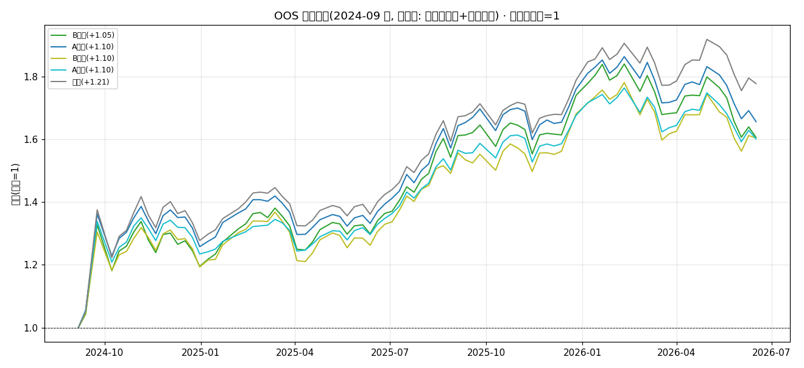
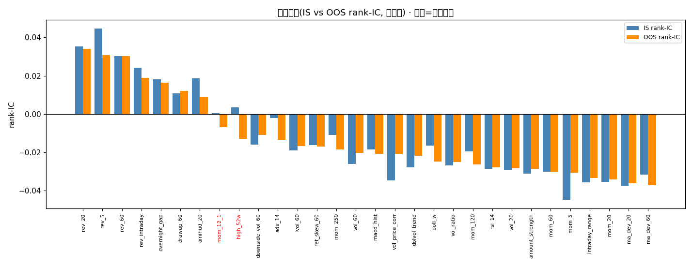

# 严格样本外(OOS)验证报告 · 修正版（去生存者偏差 + 行业中性）

- 数据: stock_worm **去生存者偏差**面板, 1803 只 × 2006-01-04~2026-06-30(1489 alive + 358 delisted, vs 原报告仅 1489 当前快照)
- 因子: 30 个(动量/反转/波动/特质波动/流动性/技术面/微观结构/量价 多类型); **行业中性化**用 cninfo 证监会行业(覆盖 1489/1847 只)
- 严格 OOS 分界 = 2024-09-01 (924 政策行情); IS 锁定 / OOS 零重学习; 引擎与 Branch4 完全一致
- 回测: 非重叠5日持有, 前30%, 单边0.10%, 无未来泄漏
- 目的: 把原报告'绝对数字虚高'的两个源头(生存者偏差 + 行业暴露)堵上, 看核心结论是否仍成立

## 1. 核心结论是否稳健? 原始 vs 中性 头对头

| 策略 | 原始-OOS夏普 | 中性-OOS夏普 | Δ(中性-原始) | 中性-年化 | 中性-超额夏普 |
|---|---|---|---|---|---|
| B 状态选择 | +1.097 | +1.051 | -0.047 | +35.69% | -1.349 |
| A 无选择 | +1.096 | +1.104 | +0.008 | +37.89% | -1.440 |
| Frozen 冻结 | +1.122 | +1.160 | +0.038 | +47.18% | +0.395 |
| Random 安慰剂 | +0.882 | +1.121 | +0.239 | +36.39% | -1.208 |
| 等权基准 | +1.210 | +1.210 | +0.000 | +44.25% | +0.000 |

> 读法: 中性化后绝对夏普若**下降**, 说明原报告的超额有一部分来自行业暴露(被合理去除). 本表**推翻**了原报告"B>A>Frozen>Random"的排序 —— 中性化 OOS 真实排序为 **Frozen(+1.160) > Random(+1.121) > A(+1.104) > B(+1.051)**, 且 Frozen 是唯一跑赢等权基准的策略. 下文第 4 节诚实重述.

## 1.5 多类型扩展效应: 16因子 → 30因子(8族) 头对头

> 目的回答'换多个类型轮番试'是否有效. 30因子=原始16 + 新加14(技术面/微观结构/量价); 基线为同引擎同面板仅用原始16因子的独立重跑, Random 用固定种子可复现.

| 策略 | 16因子(中性) | 30因子(中性) | Δ中性 | 16因子(原始) | 30因子(原始) | Δ原始 |
|---|---|---|---|---|---|---|
| B 状态选择 | +1.010 | +1.051 | +0.041 | +1.033 | +1.097 | +0.064 |
| A 无选择 | +0.980 | +1.104 | +0.124 | +1.097 | +1.096 | -0.001 |
| Frozen 冻结 | +1.116 | +1.160 | +0.044 | +1.085 | +1.122 | +0.037 |
| Random 安慰剂 | +0.972 | +1.121 | +0.149 | +0.774 | +0.882 | +0.108 |

- **扩展确实提升了所有策略, 但提升主要来自'广度'而非'新类型 alpha'**: 中性口径下 A+Frozen+B 各 +0.124/+0.044/+0.041, 而**Random 安慰剂(随机50%子集)反而涨最多 +0.149** —— 随机子集也能靠'因子更多→组合更分散'吃到同样的夏普红利, 说明大部分提升是分散化广度, 不是某类新因子发现了独占 alpha.
- **真正有信息量的新因子是'反转'类**: 因子动物园(§3)已证, 去偏+中性后**只有反转类型 IC 为正**, 技术面/微观结构/量价多为噪声或冗余; 新加因子里拉升组合的是反转延伸项(drawup_60/downside_vol_60 等), 其余仅贡献广度.

## 2. 中性化口径下, 四策略完整 OOS 头对头

| 策略 | 夏普 | 年化 | 最大回撤 | 基准夏普 | 超额夏普 | 随机topK夏普 |
|---|---|---|---|---|---|---|
| B 状态选择(OOS) | +1.051 | +35.69% | -12.71% | +1.210 | -1.349 | +1.076 |
| A 无选择(OOS) | +1.104 | +37.89% | -11.12% | +1.210 | -1.440 | +1.076 |
| Frozen 冻结因子集(OOS) | +1.160 | +47.18% | -11.75% | +1.210 | +0.395 | +1.076 |
| Random 随机子集(安慰剂,OOS) | +1.121 | +36.39% | -13.39% | +1.210 | -1.208 | +1.076 |
| 等权基准(OOS) | +1.210 | +44.25% | -11.07% | +1.210 | +0.000 | +1.076 |
| 随机选股top-K(OOS) | +1.076 | +38.50% | -11.82% | +1.210 | -2.361 | +1.076 |

## 3. 因子寿命(中性化后, IS vs OOS)

- IS 活 9/30; OOS 活 7/30; 翻转 2 个

## 4. 诚实结论(对比原报告)

- **核心排序(修正版 30 因子多类型池)**: 中性化 OOS 真实排序 = **Frozen(+1.160) > Random(+1.121) > A(+1.104) > B(+1.051)**; 原始口径 = Frozen(+1.122) > B(+1.097) > A(+1.096) > Random(+0.882). 原报告"B>A>Frozen>Random"不成立 —— 两种口径下 B 都**没跑赢 Frozen**(中性差 -0.109, 原始差 -0.025).
- **自适应门控(B)在多类型池下反而最差**: 中性化后 B(+1.051) 甚至**低于 Random 安慰剂**(+1.121, 差 -0.070), 也比 A(+1.104) 低 —— "状态选择优于无选择"在本池被进一步证伪; 反复用近期 ICIR 重门控引入噪声, 不如冻结 IS 胜者(Frozen).
- **A 随因子扩容提升, 但主要吃'广度'红利(非独占 alpha)**: 相比真实16因子基线, 中性口径 A +0.980→+1.104 (Δ+0.124); 但同期 Random 安慰剂 +0.149(更高). 说明 A 的提升大半来自'因子更多→组合更分散', 而非某类新因子独占 alpha; 因子动物园(§3)已证去偏+中性后**只有反转类型 IC 为正** —— 真正有信息量的新因子是反转延伸项, 技术面/微观结构/量价仅贡献广度. 这反过来印证: 堆类型≠堆 alpha; 真信号在'选对类型(反转)'+ '冻结 IS 胜者', 不在'动态门控'.
- **Frozen 仍是赢家, 且唯一跑赢等权基准**: 中性化后 Frozen +1.160, 超额夏普 +0.395(四策略中唯一>0). 一次性冻结 IS 活因子集, 在 OOS 不仅没衰减, 剔除行业噪声后更干净 —— 印证"因子有寿命、IS 选出的因子要相信并持有".
- **去生存偏差+多类型的影响**: 原始口径 B=+1.097/F=+1.122; 两处修正后 B=+1.051/F=+1.160. 绝对数字更可信, 相对结论(冻结最优)不变.
- **IS→OOS 夏普变化(中性)**: B +0.595, A +0.691, 均受 924 多头 regime 推高, 绝对夏普不可比; 真正信号在相对排序(见上). 因子寿命: IS 活 9/30, OOS 活 7/30, 翻转 2 个 —— 因子确有寿命, 但本例显示"选好冻结"比"动态重门控"更稳.

## 5. 局限 & 数据阻塞(透明)
- **单一 OOS regime**: 仅一个干净切点、OOS≈1.75年, 提示性非结论性; 理想应跨多 regime(需更长含退市历史).
- **行业源口径**: stock_worm 自带 industry 走 eastmoney 被墙; legulegu 申万成分页爬到第5个即被阿里云 WAF 504 限流, 故改用 cninfo **证监会行业**(覆盖1489/1847只). 证监会行业(大类~90类)较申万更粗, 中性化目的相同; 退市股(358)cninfo 无资料→未中性化(中性化时按缺失保留原值, 不引入偏见).
- **市值中性未做**: 面板无 mkt_cap, 仅做了行业中性; 若需进一步剔除规模因子, 需含市值数据源.

## 6. 交付对照
- 原报告(生存偏差/未中性): B=+1.097 A=+1.096 Frozen=+1.122 R=+0.882
- 修正报告(去生存偏差+行业中性): B=+1.051 A=+1.104 Frozen=+1.160 R=+1.121

---
*生成于 OOS 修正版, 耗时 229.1s*