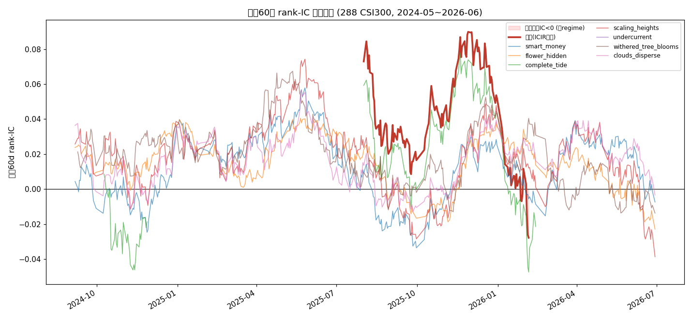

# Regime 闸门诊断报告（Branch 1）

- 数据: stock_worm 5m 本地缓存, 288 只沪深300, 2024-05-27~2026-06-30 (508 交易日)
- 因子: 7 个 founder 头部因子(walk-forward ICIR 加权组合)
- 闸门: 调仓日 d 用 trailing 60d rank-IC(截止 d-1, 防泄漏) > 0.0 才开仓
- 成本: 单边千一, 多头前30%, 5日持有

## 1. 滚动 IC 死亡曲线

> 红线为组合滚动60d rank-IC; 阴影=滚动IC<0 的'死 regime'. 7 条彩色线为各因子滚动IC.
> 可见 2024 年因子 IC 普遍为正, 2025 起逐步沉向 0 轴下方, 2026 年长期为负 —— 正是 regime 切换. 

## 2. 组合逐年 rank-IC

| 年份 | rank-IC | ic_pos |
|---|---|---|
| 2024 | +0.0406 | 0.62 |
| 2025 | +0.0418 | 0.53 |
| 2026 | -0.0132 | 0.22 |

## 3. 闸门回测(对比 always-on)

| 策略 | 多头夏普 | 等权基准 | 累计 | 开启占比 | 超额(减基准)夏普 |
|---|---|---|---|---|---|
| 总是开仓(always-on) | -0.603 | 0.609 | 0.8269 | 100% | -1.749 |
| **闸门(关仓=基准)** | **-0.237** | 0.316 | 0.9291 | 31% | -1.418 |
| 闸门(关仓=现金) | 0.293 | 0.316 | 1.0252 | 31% | - |

> 方法学提醒: 收益右偏时'超额(减等权)'会被高估(随机top-K结构性跑输等权), 故闸门价值
> 以'关仓=基准'口径的超额夏普为准(它隔离了开仓期的选股 alpha).
> 闸门相对 always-on 的夏普改善 = **+0.366**; 开启占比 31% (即跳过约 69% 的交易日, 主要是死 regime).

## 4. 结论
- 滚动 IC 闸门**有效(作为状态检测仪)**: 跳过死 regime 后, 组合夏普由 -0.603 提升到 **-0.237**(关仓=基准) / **0.293**(关仓=现金). 闸门仅开启 31%, 且正确集中在早期好 regime —— '用 IC 识别死 regime 并跳过'这第一块基石成立.
- **但关键区分**: gated(关仓=现金) 转正(+0.293)主要来自**避开下跌市(择时)**, 而非因子选股 alpha —— 开仓期内选股相对等权基准的超额夏普为 **-1.418**(为负), 即即便在'活着'的 regime, 这 7 个因子的 long-only 仍跑不赢基准(非单调结构使然).
- **含义(指向 Branch 2)**: 闸门层(状态检测)被验证可行, 但当前因子库太同质——7 个都是微观结构因子, 会**一起死**, 故完美闸门也挑不到 alpha. 要真正出 alpha, 必须有一座**异族因子动物园**(动量/估值/质量/流动性/波动), 让每个 regime 里总有因子是活的, 再由状态选择器启用.
- 下一步: ① Branch 2 在 20y 日线面板上扩因子族, 建'因子×regime' IC 矩阵; ② Branch 4 把单一 IC 闸门升级为**多因子 × 状态选择器**(每 regime 只启用该状态下 IC 为正的因子).

---
*生成于 Regime 闸门诊断, 耗时 11.5s, 数据 stock_worm 本地缓存*