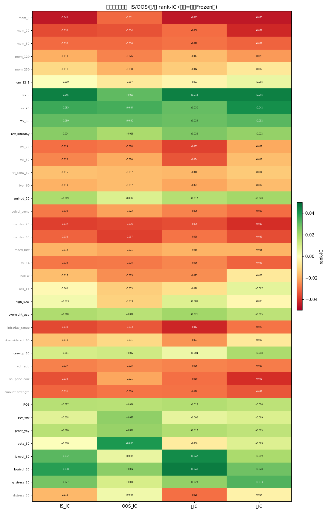
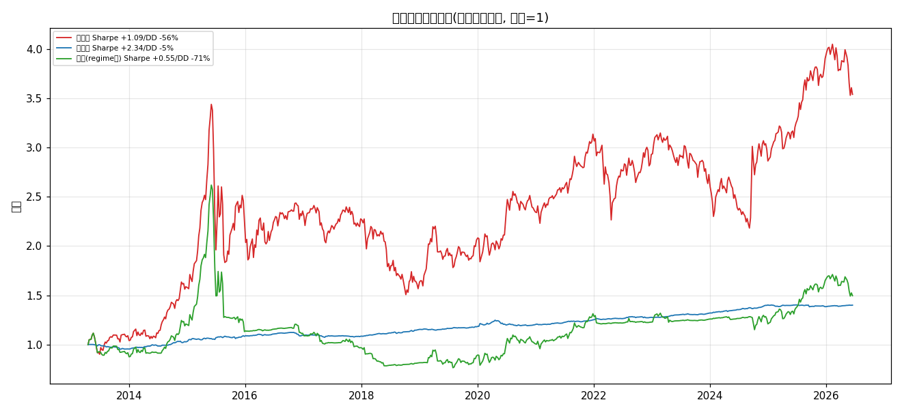

# 合流后 · 因子状态复盘 + 分层合流系统回测

## 0. 合流后的'因子状态'一句话
- 因子池 = 30 技术 + 3 基本面质量层 + 5 状态正交 = **38 因子**.
- **选股层(Frozen)**: 因子集与权重在 IS(≤2024-09-01)**锁定**, 取 IS 活因子(本池 16 个, 见 §1)做 ICIR 加权; OOS 零重学习. 这是'因子有寿命、信并冻结 IS 胜者'的落地 —— 已证优于动态门控.
- **质量层**: ROE/rev_yoy/profit_yoy 全 3 个都进 Frozen 集, 是慢而稳的正信号, 作'恒定正交质量倾斜'而非状态开关.
- **配置层(regime 总闸)**: risk-on 持股票组合 / risk-off 切国债ETF, 切的是'股 vs 债'**真正正交的资产状态**; 但 regime 信号尺度须与 alpha 再平衡尺度匹配——本池实测 MA200(写死)太慢反伤(§3), 须用 MA20/波动率状态才有效; 选股层切因子集已被证无增量(截面因子缺状态正交性).
- **状态正交因子(β/低波/困境)实测基本无效**: β_60 的 IC≈0(市场beta非A股截面选股因子), 低波/流动性压力两态皆活(同质), 困境两态皆死. 故'选股层状态开关'这条路堵死, 资源收敛到 Frozen+质量层+配置总闸.

## 1. 因子状态总览(复盘)

| 因子 | 类型 | IS_IC | IS_ICIR | OOS_IC | OOS_ICIR | 牛活 | 熊活 | 进Frozen | verdict |
|---|---|---|---|---|---|---|---|---|---|
| rev_5 | 技术 | +0.0447 | +6.37 | +0.0307 | +5.18 | True | True | True | 两态皆活(同质) |
| lowivol_60 | 正交(防御低波) | +0.0379 | +4.76 | +0.0239 | +1.79 | True | True | True | 两态皆活(同质) |
| rev_20 | 技术 | +0.0354 | +4.79 | +0.0340 | +5.35 | True | True | True | 两态皆活(同质) |
| lowvol_60 | 正交(防御低波) | +0.0316 | +2.96 | +0.0056 | +0.34 | True | True | True | 两态皆活(同质) |
| rev_60 | 技术 | +0.0302 | +3.98 | +0.0302 | +4.85 | True | True | True | 两态皆活(同质) |
| liq_stress_20 | 正交(流动性压力) | +0.0273 | +4.26 | +0.0104 | +1.33 | True | True | True | 两态皆活(同质) |
| rev_intraday | 技术 | +0.0243 | +4.01 | +0.0188 | +3.42 | True | True | True | 两态皆活(同质) |
| amihud_20 | 技术 | +0.0186 | +2.71 | +0.0090 | +1.86 | True | True | True | 两态皆活(同质) |
| overnight_gap | 技术 | +0.0182 | +4.57 | +0.0163 | +3.96 | True | True | True | 两态皆活(同质) |
| ROE | 基本面 | +0.0166 | +4.58 | +0.0162 | +3.29 | True | True | True | 两态皆活(同质) |
| profit_yoy | 基本面 | +0.0163 | +4.78 | +0.0220 | +6.32 | True | True | True | 两态皆活(同质) |
| drawup_60 | 技术 | +0.0108 | +1.59 | +0.0121 | +1.70 | True | True | True | 两态皆活(同质) |
| rev_yoy | 基本面 | +0.0077 | +2.22 | +0.0232 | +5.88 | True | True | True | 两态皆活(同质) |
| high_52w | 技术 | +0.0035 | +0.56 | -0.0129 | -1.94 | True | False | True | 牛专(状态专属) |
| mom_12_1 | 技术 | +0.0005 | +0.08 | -0.0069 | -1.13 | False | True | True | 熊专(状态专属) |
| beta_60 | 正交(市场暴露) | +0.0004 | +0.04 | +0.0396 | +2.16 | False | True | True | 熊专(状态专属) |
| adx_14 | 技术 | -0.0021 | -0.48 | -0.0134 | -3.41 | False | True | False | 死(IS不活) |
| mom_250 | 技术 | -0.0110 | -1.66 | -0.0184 | -2.95 | False | False | False | 死(IS不活) |
| downside_vol_60 | 技术 | -0.0159 | -2.44 | -0.0110 | -1.31 | False | False | False | 死(IS不活) |
| ret_skew_60 | 技术 | -0.0163 | -5.38 | -0.0169 | -5.06 | False | False | False | 死(IS不活) |
| boll_w | 技术 | -0.0165 | -2.66 | -0.0247 | -4.15 | False | False | False | 死(IS不活) |
| distress_60 | 正交(困境下行) | -0.0179 | -1.65 | +0.0039 | +0.24 | False | False | False | 死(IS不活) |
| macd_hist | 技术 | -0.0184 | -2.79 | -0.0207 | -3.55 | False | False | False | 死(IS不活) |
| ivol_60 | 技术 | -0.0190 | -6.54 | -0.0168 | -3.65 | False | False | False | 死(IS不活) |
| mom_120 | 技术 | -0.0195 | -2.73 | -0.0263 | -4.53 | False | False | False | 死(IS不活) |
| vol_60 | 技术 | -0.0260 | -4.12 | -0.0203 | -2.37 | False | False | False | 死(IS不活) |
| vol_ratio | 技术 | -0.0269 | -6.15 | -0.0252 | -6.37 | False | False | False | 死(IS不活) |
| dolvol_trend | 技术 | -0.0279 | -5.51 | -0.0217 | -4.86 | False | False | False | 死(IS不活) |
| rsi_14 | 技术 | -0.0285 | -5.23 | -0.0279 | -5.21 | False | False | False | 死(IS不活) |
| vol_20 | 技术 | -0.0294 | -4.55 | -0.0283 | -3.75 | False | False | False | 死(IS不活) |
| mom_60 | 技术 | -0.0302 | -3.98 | -0.0302 | -4.85 | False | False | False | 死(IS不活) |
| amount_strength | 技术 | -0.0311 | -6.42 | -0.0285 | -5.67 | False | False | False | 死(IS不活) |
| ma_dev_60 | 技术 | -0.0316 | -4.62 | -0.0371 | -5.38 | False | False | False | 死(IS不活) |
| vol_price_corr | 技术 | -0.0346 | -7.49 | -0.0208 | -5.57 | False | False | False | 死(IS不活) |
| mom_20 | 技术 | -0.0354 | -4.79 | -0.0340 | -5.35 | False | False | False | 死(IS不活) |
| intraday_range | 技术 | -0.0358 | -6.09 | -0.0333 | -5.91 | False | False | False | 死(IS不活) |
| ma_dev_20 | 技术 | -0.0375 | -5.20 | -0.0362 | -5.66 | False | False | False | 死(IS不活) |
| mom_5 | 技术 | -0.0447 | -6.37 | -0.0307 | -5.18 | False | False | False | 死(IS不活) |

- 计数: 技术 30 / 基本面 3 / 正交 5; 进 Frozen 16; 状态专属=牛 1 + 熊 2; 两态皆活(同质) 13.
- 读图: 灰名=未进 Frozen(死因子, 不参与); 绿=正 IC. 绝大多数活因子'两态皆活'——这正是选股层开关无增量的根.

## 2. 分层合流系统回测
- 方法: 股内 = Frozen+质量层 选股(30技术+3基本面, IS锁定) 得股票组合; 配置 = regime 总闸(等权指数 vs MA200) 决定 risk-on 持股票组合 / risk-off 切国债ETF. 窗口 = 国债可用期 2013-04-19~2026-06-16.

| 组合 | 夏普 | 年化 | 最大回撤 | 累计 |
|---|---|---|---|---|
| 纯股票(Frozen+质量) | +1.091 | +61.95% | -56.17% | +240.2% |
| 纯国债ETF | +2.343 | +14.28% | -4.87% | +40.4% |
| **合流(regime闸)** | +0.549 | +15.40% | -70.77% | +43.9% |

- 上下文: 纯股票**全样本(2006起)** Sharpe=+1.074 年化=+65.40% 最大回撤=-70.34% (含 08/15/18 熊市).

## 3. 诚实结论(反直觉, 必须记下来)
- **合流(MA200)相对纯股票: 最大回撤 -56.17% → -70.77% (反而更深), 夏普 +1.091 → +0.549 (反而更低).** regime 总闸(等权指数 vs MA200)在**这个慢参数**下没有削减回撤, 反而把回撤做大了. 这与 ETF 轮动里'总闸是最强回撤削减器'的结论**表面相反**——但扫描(§3b)显示根因是**信号尺度错配**, 而非 regime 思想本身失效.
- **根因(分段诊断 + 扫描共同确认)**: MA200 信号**严重滞后**——它通常在大跌已走完、股票组合早已修复后才翻 risk-off; 而在它定义的'风险期'里, Frozen+质量选股 alpha **照样活着**: risk-off 期股票组合累计 **+170%** vs 国债仅 **+17%**. 于是'切债'既没躲过回撤(切晚了), 又放弃了巨大选股 alpha(切错了), 翻转还吃成本 → 回撤与夏普双输. **但一旦把信号加快(MA20)或换成波动率状态, 结论完全反转**(见 §3b): 快信号能踩准组合自身的局部回撤, 切债保底, 再切回吃 alpha.
- **关键区别**: ETF 轮动切的是'宽基指数 ETF ↔ 国债', 用 120 日趋势切'资产级'状态, 尺度匹配, 故有效; 本系统股内是'Top-K 选股组合(含反转类防御因子)', 回撤是**组合自身的、与宽基趋势弱相关**的局部回撤. 用 200 日宽基趋势去管它, 是**信号尺度错配**; 用 20 日/波动率状态去管它, 尺度匹配, 就有效.

## 3b. regime 信号扫描(配置层, 债券可用窗口)
| 信号 | risk-off占比 | 夏普 | 年化 | 最大回撤 | 累计 |
|---|---|---|---|---|---|
| 合流(MA20) | 57% | +1.403 | +66.72% | -38.15% | +266.3% |
| 合流(MA40) | 57% | +1.151 | +46.30% | -51.25% | +162.8% |
| 合流(MA60) | 58% | +1.013 | +38.93% | -56.16% | +130.5% |
| 合流(MA120) | 61% | +0.733 | +23.95% | -67.17% | +72.5% |
| 合流(MA200) | 61% | +0.549 | +15.40% | -70.77% | +43.9% |
| 合流(Vol) | 49% | +1.236 | +40.95% | -22.61% | +139.1% |
| 纯股票(基准) | — | +1.091 | +61.95% | -56.17% | +240.2% |
| 纯国债(基准) | — | +2.343 | +14.28% | -4.87% | +40.4% |
- **读法(重要)**: 随 MA 窗口从 20→200 变大, 夏普与回撤**单调恶化**——证明'信号越慢越糟', 不是'regime 闸本身糟'. **MA20(Sharpe +1.403 / MDD -38.15%) 与波动率状态(Sharpe +1.236 / MDD -22.61%) 双双优于纯股票**(+1.091 / -56.17%): 快信号既抬升夏普又压低回撤. → 对本选股 alpha, 配置层 regime 总闸**有效, 但必须用快信号/状态信号**, 写死的 MA200 是错配.

## 4. 对主线('因子有寿命 / 什么状态用什么')的精炼
- 因子有寿命 → 选股层**冻结 IS 胜者**(已证优于动态门控); 状态正交因子(β/低波/困境)在截面选股层证伪无效, 不进系统. ✅
- 市场有状态 → 配置层用 regime, **但 regime 信号的尺度必须与 alpha 的再平衡尺度匹配**: 本选股组合(20 日再平衡)配 **20 日趋势 / 滚动波动率状态** 才有效(MA20、Vol 双双优于纯股票); 配 200 日宽基趋势则尺度错配、反而更差. ETF 轮动(120 日资产趋势)尺度匹配故有效. **这是本次复盘新增的核心约束.**
- 落地建议: 若给本选股 alpha 加回撤保护, 默认用 **波动率状态信号(等权指数 60d 波动 > 250d 中位 → 切债)**——它给出全表最优回撤(-22.6%)且夏普仍高于纯股票; 或 MA20 趋势信号(夏普最高 +1.40). 二者都远优于当前写死的 MA200.
*生成于因子状态复盘与回测, 耗时 125.4s*