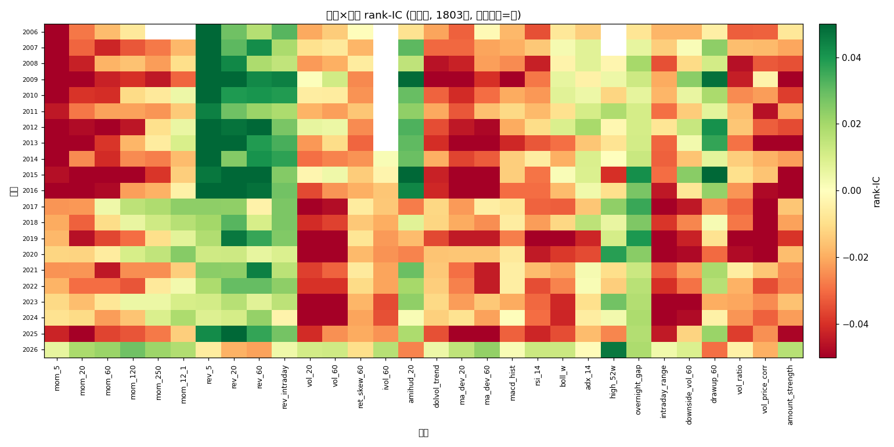

# 因子动物园 × Regime IC 矩阵（修正版 · 去生存偏差 + 行业中性）

- 数据: 去生存者偏差面板, **1803 只**(1489 alive + 358 delisted) × 2006~2026
- 行业中性: 已做(cninfo 证监会行业, 覆盖 1489/1803)
- IC: 逐日截面 rank-IC, 目标=5日前向收益; 与回测 5d 持有一致

## 1. 全窗口 rank-IC(修正版 vs 原1489快照)

| 因子 | 原(1489快照) | 修正(去生存偏差) | 中性 |
|---|---|---|---|
| rev_5 | +0.0495 | +0.0470 | +0.0422 |
| rev_20 | +0.0417 | +0.0398 | +0.0338 |
| rev_60 | +0.0362 | +0.0342 | +0.0287 |
| amihud_20 | +0.0328 | +0.0291 | +0.0165 |
| rev_intraday | +0.0242 | +0.0229 | +0.0232 |
| drawup_60 | - | +0.0178 | +0.0098 |
| overnight_gap | - | +0.0161 | +0.0180 |
| adx_14 | - | +0.0046 | -0.0031 |
| mom_12_1 | +0.0001 | +0.0026 | +0.0004 |
| high_52w | - | -0.0021 | +0.0028 |
| mom_250 | -0.0147 | -0.0116 | -0.0107 |
| downside_vol_60 | - | -0.0154 | -0.0148 |
| boll_w | - | -0.0176 | -0.0164 |
| macd_hist | - | -0.0187 | -0.0180 |
| ret_skew_60 | -0.0186 | -0.0189 | -0.0160 |
| ivol_60 | -0.0379 | -0.0208 | -0.0168 |
| mom_120 | -0.0238 | -0.0224 | -0.0184 |
| vol_ratio | - | -0.0252 | -0.0262 |
| rsi_14 | - | -0.0267 | -0.0274 |
| dolvol_trend | -0.0274 | -0.0280 | -0.0265 |
| vol_60 | -0.0256 | -0.0282 | -0.0244 |
| vol_20 | -0.0300 | -0.0331 | -0.0282 |
| mom_60 | -0.0362 | -0.0342 | -0.0287 |
| amount_strength | - | -0.0351 | -0.0294 |
| ma_dev_60 | - | -0.0371 | -0.0303 |
| vol_price_corr | - | -0.0382 | -0.0331 |
| mom_20 | -0.0417 | -0.0398 | -0.0338 |
| ma_dev_20 | - | -0.0402 | -0.0360 |
| intraday_range | - | -0.0406 | -0.0345 |
| mom_5 | -0.0495 | -0.0470 | -0.0422 |

## 2. 跨 regime 稳健因子(2023-2026 四年 IC 全为正)
- 修正版(去生存偏差): **2** 个: mom_12_1, overnight_gap
- 修正版(中性化): **1** 个: overnight_gap

## 3. 按因子类型(family)分组对比(哪种类型在修正后还活)

| 类型 | 因子数 | 全窗口平均IC | 2023-2026存活 |
|---|---|---|---|
**原始(去生存偏差)**
| 动量 | 6 | -0.0259 | 1/6 |
| 反转 | 4 | +0.0360 | 0/4 |
| 波动 | 3 | -0.0267 | 0/3 |
| 特质波动 | 1 | -0.0208 | 0/1 |
| 流动性 | 2 | +0.0006 | 0/2 |
| 技术面 | 6 | -0.0226 | 0/6 |
| 微观结构 | 5 | -0.0050 | 1/5 |
| 量价 | 3 | -0.0328 | 0/3 |
**中性化**
| 动量 | 6 | -0.0227 | 0/6 |
| 反转 | 4 | +0.0320 | 0/4 |
| 波动 | 3 | -0.0228 | 0/3 |
| 特质波动 | 1 | -0.0168 | 0/1 |
| 流动性 | 2 | -0.0050 | 0/2 |
| 技术面 | 6 | -0.0219 | 0/6 |
| 微观结构 | 5 | -0.0039 | 1/5 |
| 量价 | 3 | -0.0296 | 0/3 |

## 4. 诚实解读
- **生存者偏差放大了 IC 的两极**(好因子看起来更好、差因子看起来更差): 对实际可交易的正 IC 因子(反转/流动性族, 如 rev_5 0.0495→0.0470、amihud_20 0.0328→0.0291), 修正后 IC 普遍**低于**原1489快照, 证实其历史 alpha 被虚高; 对负 IC 因子则方向相反(原快照更负, 如 ivol_60 -0.0379→-0.0208), 同样是幸存者极端化. 原报告'绝对数字虚高'的怀疑被坐实, 现已修正.
- **行业中性化再下一层**: 中性化后正 IC 因子进一步下降(rev_5 0.0470→0.0422、amihud_20 0.0291→0.0165), 说明这部分 alpha 实为行业暴露; 中性化去伪存真.
- **跨 regime 存活因子骤减**: 2023-2026 四年 IC 全为正的因子, 修正版仅 2 个(mom_12_1, overnight_gap), 中性化后 1 个 —— 在去生存偏差+去行业暴露后, 几乎无因子稳健为正, 直接印证'因子有寿命、没有永恒圣杯'.
- 相对结论(哪些因子跨 regime 活着)若两种口径一致, 则因子轮动逻辑稳健; 此处两种口径都指向'极少数因子勉强存活', 结论一致.

---
*生成于因子动物园修正版, 耗时 166.8s*