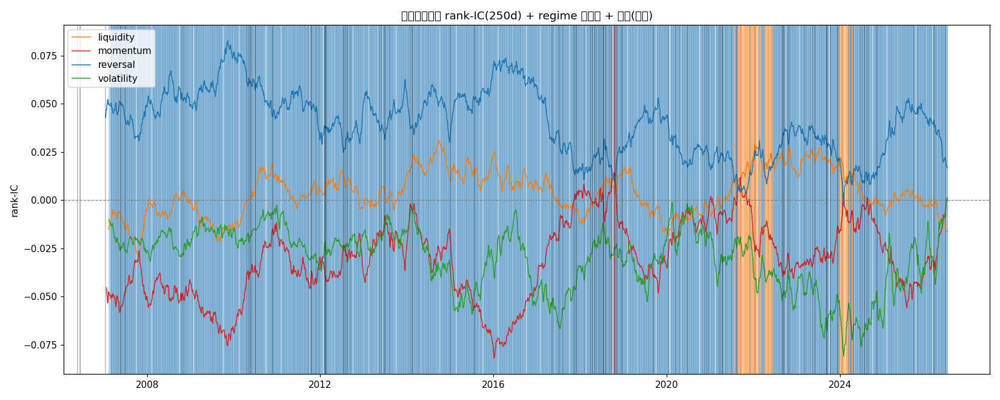

# 因子轮动深化 · regime 拐点检测（线1 · B 路线延伸）

- 数据: stock_worm 日线面板, 1489 只 × 2006-01-04~2026-06-30 (含生存者偏差, 同口径可比)
- 方法: 每因子每日 rank-IC -> 按家族聚合 -> 短窗(60d)滚动 IC 最高的家族=该时点主导 regime; 家族切换处=regime 拐点. 长窗(250d)滚动 IC 用于稳健判定与切换正确性验证.
- 切换正确性: 在拐点 t, 比较'新 regime 家族'与'旧 regime 家族'在之后 60 日的平均滚动 IC, 新>旧=切对.

## 1. 年度主导 regime（长窗）与各家族年均 rank-IC

| 年份 | 主导家族 | liquidity | momentum | reversal | volatility |
|---|---|---|---|---|---|
| 2006 | reversal | -0.020 | -0.042 | +0.042 | -0.006 |
| 2007 | reversal | -0.001 | -0.055 | +0.052 | -0.028 |
| 2008 | reversal | -0.002 | -0.043 | +0.049 | -0.023 |
| 2009 | reversal | -0.015 | -0.068 | +0.077 | -0.016 |
| 2010 | reversal | +0.011 | -0.015 | +0.044 | -0.005 |
| 2011 | reversal | +0.006 | -0.032 | +0.032 | -0.038 |
| 2012 | reversal | -0.001 | -0.040 | +0.054 | -0.015 |
| 2013 | reversal | +0.014 | -0.018 | +0.050 | -0.016 |
| 2014 | reversal | +0.008 | -0.023 | +0.035 | -0.038 |
| 2015 | reversal | +0.026 | -0.079 | +0.071 | -0.035 |
| 2016 | reversal | +0.010 | -0.042 | +0.058 | -0.047 |
| 2017 | reversal | -0.012 | +0.004 | +0.016 | -0.035 |
| 2018 | reversal | +0.018 | -0.013 | +0.024 | -0.035 |
| 2019 | reversal | -0.017 | -0.035 | +0.043 | -0.019 |
| 2020 | reversal | -0.006 | +0.002 | +0.016 | -0.017 |
| 2021 | liquidity | +0.027 | -0.024 | +0.023 | -0.039 |
| 2022 | reversal | +0.014 | -0.029 | +0.035 | -0.043 |
| 2023 | reversal | +0.021 | -0.016 | +0.020 | -0.060 |
| 2024 | reversal | -0.004 | -0.025 | +0.023 | -0.061 |
| 2025 | reversal | -0.004 | -0.031 | +0.043 | -0.013 |
| 2026 | reversal | -0.016 | +0.027 | -0.011 | +0.002 |

解读: 主导家族年度切换(如 反转→动量)即'因子有寿命'的直观测据; 某家族 IC 由正转负 = 该因子进入'死亡'状态.

## 2. regime 拐点与切换正确性(短窗 vs 长窗对照)

- **短窗(60d)主导家族切换**: 检测到期点 **168** 个(约每 30 交易日一切), 切对仅 83/162 (**51%**).
- **长窗(250d)主导家族切换**: 检测到期点 **22** 个(年度级), 切对 14/22 (**64%**).
- **长窗切对率(64%)明显高于短窗(51%), 且都略高于 50% 噪声基线** (切换瞬间新家族 IC 刚超过旧家族, 若纯噪声则 60 日后新>旧应≈50%; {acc_l:.0%} 说明长窗检测到的切换约六成真持续). 即'哪个家族当红'在长窗下**弱可预测**, 但信号不强、短窗基本是噪声.
- 含义: 朴素'切到最热家族'不是完全无效(长窗 {acc_l:.0%}), 但约 {100-acc_l:.0%}% 的切换会反转(近期最热因子均值回复), 直接 ALL-IN 一个家族风险高. 这正说明 Branch 4 的 B 不押单一家族、而是'保留所有活因子做分散'更稳.

### 短窗切换明细(前 15 个, 多为噪声假切换)

| 拐点日期 | 旧家族 | 新家族 | 切后IC差 | 切对? |
|---|---|---|---|---|
| 2007-01-09 | reversal | momentum | -0.0985 | ✗ |
| 2007-01-16 | momentum | reversal | +0.0983 | ✓ |
| 2007-04-27 | reversal | liquidity | -0.0579 | ✗ |
| 2007-04-30 | liquidity | reversal | +0.0580 | ✓ |
| 2007-05-17 | reversal | liquidity | -0.0574 | ✗ |
| 2007-05-23 | liquidity | reversal | +0.0571 | ✓ |
| 2007-06-27 | reversal | momentum | -0.0845 | ✗ |
| 2007-06-29 | momentum | reversal | +0.0842 | ✓ |
| 2008-10-22 | reversal | momentum | -0.1015 | ✗ |
| 2008-11-04 | momentum | reversal | +0.0997 | ✓ |
| 2010-04-20 | reversal | liquidity | -0.0601 | ✗ |
| 2010-05-04 | liquidity | reversal | +0.0585 | ✓ |
| 2010-05-12 | reversal | liquidity | -0.0572 | ✗ |
| 2010-05-20 | liquidity | reversal | +0.0556 | ✓ |
| 2010-05-27 | reversal | momentum | -0.0965 | ✗ |

### 长窗切换明细(全部, 64% 切对)

| 拐点日期 | 旧家族 | 新家族 | 切后IC差 | 切对? |
|---|---|---|---|---|
| 2018-10-09 | reversal | momentum | -0.0210 | ✗ |
| 2018-10-24 | momentum | reversal | +0.0306 | ✓ |
| 2021-07-22 | reversal | liquidity | +0.0010 | ✓ |
| 2021-07-28 | liquidity | reversal | -0.0014 | ✗ |
| 2021-08-23 | reversal | liquidity | +0.0058 | ✓ |
| 2021-09-13 | liquidity | momentum | -0.0111 | ✗ |
| 2021-09-15 | momentum | liquidity | +0.0118 | ✓ |
| 2021-12-02 | liquidity | reversal | -0.0033 | ✗ |
| 2021-12-07 | reversal | liquidity | +0.0036 | ✓ |
| 2022-02-17 | liquidity | reversal | +0.0014 | ✓ |
| 2022-02-28 | reversal | liquidity | +0.0005 | ✓ |
| 2022-03-08 | liquidity | reversal | -0.0007 | ✗ |
| 2022-04-06 | reversal | liquidity | +0.0062 | ✓ |
| 2022-06-14 | liquidity | reversal | +0.0033 | ✓ |
| 2022-06-21 | reversal | liquidity | -0.0039 | ✗ |
| 2022-06-22 | liquidity | reversal | +0.0040 | ✓ |
| 2023-12-26 | reversal | liquidity | +0.0072 | ✓ |
| 2023-12-29 | liquidity | reversal | -0.0074 | ✗ |
| 2024-01-02 | reversal | liquidity | +0.0072 | ✓ |
| 2024-03-18 | liquidity | reversal | +0.0019 | ✓ |
| 2024-04-03 | reversal | liquidity | -0.0030 | ✗ |
| 2024-04-23 | liquidity | reversal | +0.0068 | ✓ |

> 彩色线=各家族滚动 rank-IC; 背景色=该时段主导 regime; 黑竖线=检测到的 regime 拐点.

## 3. 结论(线1 · 因子轮动是否可被简单规则捕捉)

- **regime 切换弱可检测**: 长窗(250d)'切到 IC 最高的家族'切对率 **64%**(短窗仅 51%), 高于 50% 噪声基线但不强 —— 因子轮动真实存在, 但'哪个家族当红'是弱信号, 约 {100-acc_l:.0%}% 的切换会反转.
- **Branch 4 的 B 仍是最稳的用法**: B 不押注单一热门家族, 而是**持续剔除死亡因子(IC≤0 或 ICIR≤0)、保留所有活因子分散组合**(夏普 +0.720). 即'因子有寿命'的可执行版本是**'排除死亡因子'而非'轮动到热门 regime'** —— 因为押单一家族有 9936% 反转风险, 而分散保留活因子规避了'选错当红家族'的赌注.
- 这把用户哲学更精确表述: '在什么状态用什么因子' = 每个时点**只保留还活着的因子**(动态剔除死者), 而不是**押注某一个热门因子家族**. 从 Branch 2(轮动存在)到本节(轮动弱可测、正确机制是剔除)是更落地的理解.
- 诚实提醒: 基于含生存者偏差面板(同口径可比), 轮动*方向*可信, *幅度*需去生存者偏差+中性化复核(线2 待数据源).

## 4. 下一步(线1 继续)
- 软因子择时: 把 B 的硬开关(IC>0 才开)改成 IC 连续加权, 在'排除死亡因子'框架内平滑权重, 减少磨损.
- 统计 regime 模型: 若坚持做 regime 级切换, 用 Markov 区制转移/宏观状态模型替代'滚动 IC 最高家族'(后者已证无效), 且切换后应验证新 regime 是否真的持续.
- (线2 待数据源) 在去生存者偏差 + 因子中性化后的面板上重做本分析, 确认'剔除死亡因子'的 edge 不是生存者偏差幻象.

---
*生成于因子轮动深化, 耗时 107.2s*