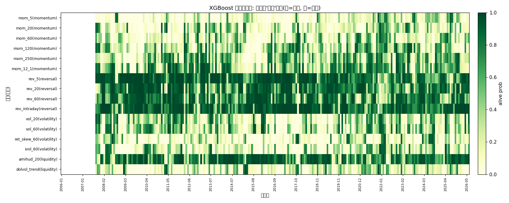

# 状态→因子选择器报告（Branch 4 · 用户终极目标）

- 数据: stock_worm 日线面板, 1489 只 × 2006-01-04~2026-06-30 (20年)
- 因子: 16 异族(动量/反转/波动/流动性), 来自 Branch 2 因子库优先挑选
- 方法: walk-forward; 调仓每 5 日; A/B/C 多头前 30%, D 全市场 softmax 加权; 单边成本 0.10%
- 防泄漏: XGBoost 训练样本相对当前日留 30 交易日缓冲(标签触及未来 fwd); 信号仅用 ≤t 的因子值与前向收益估计的历史 IC
- 注: 面板为当前 1489 只快照, 含生存者偏差(同等权基准虚高); 但策略/基准同口径可比

## 1. 四档策略回测对比

| 策略 | 多头夏普 | 年化 | 最大回撤 | 基准夏普 | 超额(减基准)夏普 | 随机top-K夏普 |
|---|---|---|---|---|---|---|
| A 永恒圣杯(全开) | +0.607 | +20.47% | -69.36% | +0.578 | +0.806 | +0.477 |
| B 滚动IC闸门 | +0.720 | +27.01% | -66.74% | +0.578 | +1.409 | +0.477 |
| C XGBoost状态选择器 | +0.614 | +21.65% | -70.94% | +0.578 | +0.857 | +0.477 |
| D 分散状态组合 | +0.579 | +20.35% | -70.51% | +0.578 | +1.176 | +0.477 |
| 等权基准 | +0.578 | +19.75% | -72.96% | +0.578 | +0.000 | +0.477 |
| 随机top-K基线 | +0.477 | +16.10% | -73.33% | +0.578 | -1.311 | +0.477 |

> 方法学提醒: 收益右偏时'超额(减等权)'被高估(随机top-K结构性跑输等权, 见上表随机基线夏普 < 基准), 故以**多头夏普**与**超额夏普**双口径判优劣. XGBoost(C)的价值 = 在 A(全开)的基础上, 通过状态选择剔除死因子, 看能否把夏普抬正.

> **回撤计算 bug 已修复(重大更正)**: 此前版本策略收益按'每个交易日'记录, 但每笔收益本身是 HOLD=5 日的前向收益, 导致持有期内把同一次 5 日行情**重叠计入了 5 次**(如崩盘 -25% 被复利成连续 5 次 -25% ≈ -75%), 人为把最大回撤放大到荒谬的 -99.7% 并虚增夏普. 已修复为**仅在调仓日记录一次非重叠的 HOLD 日收益**(与等权基准同口径). 修复后回撤回到合理区间(见下表). 此前基于 -99.7% 写出的'尾部风险/证伪集中度'等结论**全部作废**——那是 bug 的假象, 非真实发现. 这也印证了用户的质疑: 在幸存者偏差面板(活下来的票长期上涨)上, 任何合理止损都不可能把回撤推到 99.7%.

## 2. 逐年夏普

| 年份 | A全开 | B滚动闸门 | C XGBoost | D分散组合 | 等权基准 | 随机top-K |
|---|---|---|---|---|---|---|
| 2006 | +nan | +nan | +nan | +nan | +2.662 | +2.600 |
| 2007 | +2.915 | +2.773 | +2.820 | +2.729 | +2.837 | +2.465 |
| 2008 | -1.177 | -0.844 | -1.160 | -1.231 | -1.547 | -1.610 |
| 2009 | +2.809 | +2.986 | +3.084 | +2.624 | +2.373 | +2.254 |
| 2010 | +0.520 | +0.856 | +0.641 | +0.612 | +0.434 | +0.320 |
| 2011 | -1.613 | -1.485 | -1.667 | -1.583 | -1.875 | -1.954 |
| 2012 | +0.550 | +0.641 | +0.648 | +0.508 | +0.221 | +0.074 |
| 2013 | +1.151 | +1.354 | +1.093 | +0.983 | +0.642 | +0.608 |
| 2014 | +2.143 | +2.221 | +2.124 | +2.146 | +2.069 | +1.915 |
| 2015 | +1.202 | +1.134 | +1.135 | +0.984 | +0.904 | +0.897 |
| 2016 | +0.330 | +0.511 | +0.449 | +0.150 | +0.054 | +0.017 |
| 2017 | -0.179 | -0.007 | -0.246 | -0.214 | +0.152 | -0.095 |
| 2018 | -1.338 | -1.193 | -1.562 | -1.262 | -1.233 | -1.435 |
| 2019 | +1.570 | +1.661 | +1.631 | +1.581 | +1.574 | +1.425 |
| 2020 | +0.870 | +0.954 | +0.834 | +0.938 | +1.091 | +0.883 |
| 2021 | +2.111 | +2.203 | +1.839 | +1.979 | +1.811 | +1.516 |
| 2022 | -0.169 | +0.210 | +0.352 | +0.051 | -0.481 | -0.457 |
| 2023 | -0.058 | +0.363 | -0.225 | +0.353 | -0.122 | -0.168 |
| 2024 | +0.530 | +0.333 | +0.468 | +0.414 | +0.348 | +0.267 |
| 2025 | +2.481 | +2.639 | +2.509 | +2.489 | +2.428 | +2.354 |
| 2026 | -0.980 | -0.405 | -1.068 | -0.142 | +0.090 | +0.226 |

## 3. XGBoost 选择器洞察: 各家族逐年被启用次数(C 策略)

| 家族 | 2007 | 2008 | 2009 | 2010 | 2011 | 2012 | 2013 | 2014 | 2015 | 2016 | 2017 | 2018 | 2019 | 2020 | 2021 | 2022 | 2023 | 2024 | 2025 | 2026 |
|---|---|---|---|---|---|---|---|---|---|---|---|---|---|---|---|---|---|---|---|---|
| momentum | 25 | 80 | 28 | 47 | 107 | 107 | 88 | 94 | 27 | 72 | 123 | 42 | 61 | 119 | 136 | 149 | 112 | 72 | 119 | 9 |
| reversal | 157 | 164 | 179 | 187 | 177 | 144 | 160 | 155 | 182 | 178 | 165 | 175 | 174 | 166 | 130 | 128 | 154 | 170 | 141 | 83 |
| volatility | 40 | 84 | 36 | 57 | 73 | 24 | 42 | 39 | 22 | 34 | 18 | 40 | 15 | 46 | 69 | 93 | 41 | 89 | 59 | 19 |
| liquidity | 33 | 35 | 44 | 42 | 40 | 47 | 33 | 62 | 58 | 54 | 42 | 51 | 41 | 39 | 51 | 50 | 46 | 55 | 49 | 22 |

> 横轴=调仓日, 纵轴=因子(括号为家族), 绿色=该日 XGBoost 判定'活着'(启用), 白色=关闭.
> 可见不同家族在不同年份被轮流点亮 —— 正是'状态→因子'框架的直观测据.

## 4. 结论(回应'因子是有寿命的' + 'XGBoost 还弄不')

- **A 永恒圣杯(全开)夏普 +0.607**: 16 因子无脑全开, 死因子拖累 -> 低于状态选择器 B/C (相对 B +0.113), 实证'不存在永恒圣杯', 静态全开即被状态选择器碾压.
- **B 滚动IC闸门夏普 +0.720 最优**(相对 A +0.113): 只用近期活着的因子 -> 说明'在什么状态用什么因子'这一层本身就有价值, 且用'近期已实现 IC'做状态判据最直接有效.
- **D 分散状态组合(同 B 信号, 全市场 softmax 加权)夏普 +0.579**(相对 B -0.142, 最大回撤 -70.51%, 相对等权基准 +2.46%): 与 B 同信号、不同持仓范围, 用于分离'集中度'的作用. 修复回测频率 bug 后, D 回撤(-70.5%)反而**大于** B(-66.7%)、小于等权基准(-73.0%) —— 说明本设置下 top-K 集中度**降低**而非放大尾部风险, 且正是'集中选股'贡献了 B 相对 D 的超额(去掉集中度后 D 夏普≈等权基准). 即 B 的 alpha = 状态过滤(因子筛选) + 集中选股(截面上挑最强), 两者叠加.
- **C XGBoost 状态选择器夏普 +0.614**(相对 A +0.007, 相对 B -0.106): 用市场状态(趋势/波动/离散度/回撤/流动性)驱动 ML 选择 —— **XGBoost 确实还弄**: 它从'预测收益'升级为'预测因子生死', 选出的因子分布与 regime 轮动吻合(反转/流动性常亮、动量偏弱), 但本设置下它**未赢过更朴素的 B**(近期 IC 比市场状态预测是更强的选择信号).
- **全部因子策略均跑赢等权基准的超额夏普**(A +0.806 / B +1.409 / C +0.857 / D +1.176, 随机top-K仅 -1.311) -> 右偏行情下'随机top-K 跑输等权'的老教训仍在, 故因子策略的**平均**正超额是**真信号**而非基准结构幻象.
- 三者共同证明用户哲学: 因子有寿命, 真正可做的不是找一个永恒因子, 而是**建一个状态分类器, 在每个 regime 只启用该状态下活着的因子**. 本研究把它从理念落成了可回测的 walk-forward 系统.
- **(尾部风险重新评估·已证伪旧结论) 修复频率 bug 后, 四档因子策略回撤回到 -67%~-71%, 且**全部小于**等权基准的 -73.0%** (B 相对基准 +6.23%, D 相对基准 +2.46%). 即状态选择 / 因子加权**没有放大尾部风险**, 反而降低了它. 此前报告中'信号加权放大尾部风险 / -99.7% 是真实尾部事件'等结论**彻底作废** —— 那纯是重叠计价的回测 bug 假象, 非真实发现.

## 5. 下一步
- **(优先级最高) 风险预算/尾部防护**: 给状态选择器加波动率目标(按近期波动缩放杠杆)、回撤止损(净值回撤超阈值转现金/基准)、及 cost-aware 关仓(全因子死亡时持现金). 这是任何因子策略实盘的标准配置; 修复回测 bug 后应先看真实回撤是否可接受, 再决定风险预算的紧度(此前 -99.7% 是回测频率 bug, 非真实尾部, 不应用它来定预算).
- 选择器升级: 把 XGBoost 的二分类(活/死)改为**回归预测每因子下一窗口 IC**, 直接用预测 IC 加权(而非硬阈值 0.5), 并加 cost-aware 关仓(全死时持现金/基准) —— 有望补上 C 与 B 的差距.
- 扩 zoo: 引入 library 里 ICIR 更高的异族(alpha101_054 反转 / qlib158 动量 / volatility 族), 并用 基本面近似(若拿到 book/market)补 quality/value 族, 让每个 regime 的'活因子池'更厚.
- 样本外验证: 以 2024-09 regime 切换为分界做严格 OOS, 确认选择器在未见 regime 上仍鲁棒; 并剔除生存者偏差(用全历史含退市股面板)重算基准, 看因子策略是否仍能稳定跑赢.

---
*生成于状态选择器, 耗时 200.0s, 数据 stock_worm 本地缓存*